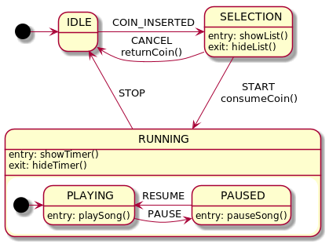

# Stateless4j Example

## Sample

This is example of a state machine created using 
[stateless4j](https://github.com/stateless4j/stateless4j) library.

This example models a simple jukebox.



The above diagram encoded using `stateless4j` API:

```
 var config = new StateMachineConfig<State, Trigger>();

 config.configure(State.IDLE)
         .permit(Trigger.COIN_INSERTED, State.SELECTION);

 config.configure(State.SELECTION)
         .onEntry(Main::showSongsList)
         .onExit(Main::hideSongsList)
         .permit(Trigger.START, State.PLAYING, Main::consumeCoin)
         .permit(Trigger.CANCEL, State.IDLE, Main::returnCoin);

 config.configure(State.RUNNING)
         .onEntry(Main::showTimer)
         .onExit(Main::hideTimer)
         .permit(Trigger.STOP, State.IDLE);

 config.configure(State.PLAYING)
         .substateOf(State.RUNNING)
         .onEntry(Main::playSong)
         .permit(Trigger.PAUSE, State.PAUSED);

 config.configure(State.PAUSED)
         .substateOf(State.RUNNING)
         .onEntry(Main::pauseSong)
         .permit(Trigger.RESUME, State.PLAYING);
```

Refer to full example [source code](src/main/java/com/github/stateless4j/sample/Main.java)

## Diagram

Diagram is created using [PlantUML](http://plantuml.com/). You can install [PlantUML plugin for JetBrains IDEA](https://github.com/esteinberg/plantuml4idea) 
to enjoy real-time preview. See top of `Main` class.

## Licence

[Apache License, Version 2.0](LICENSE.txt)

